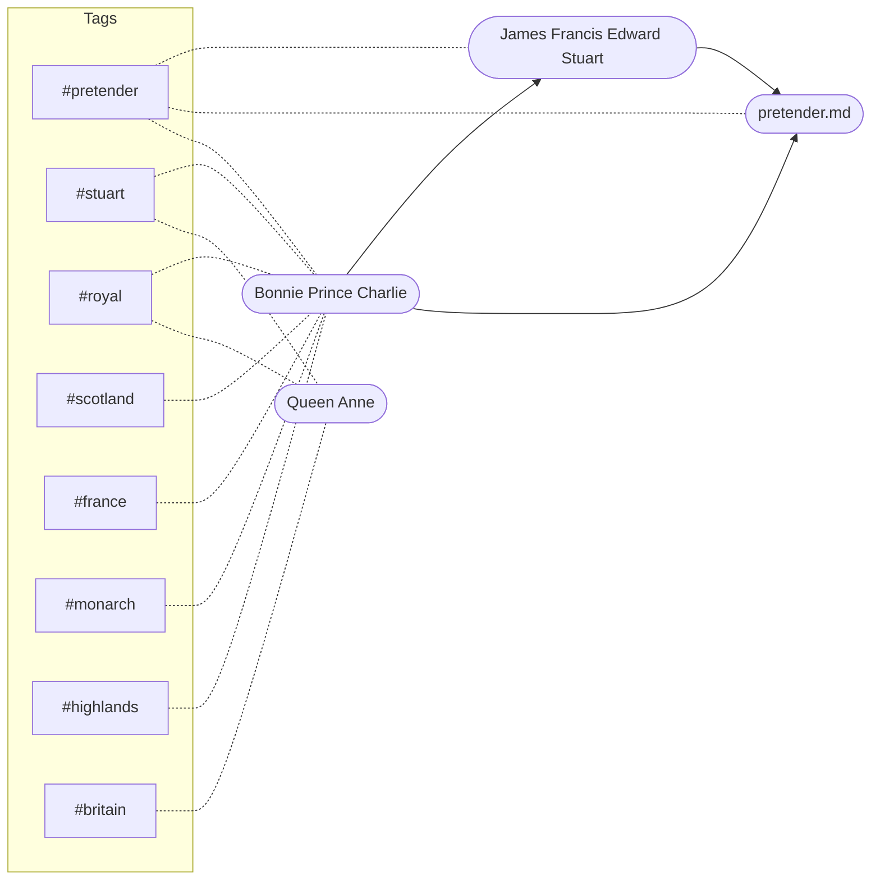
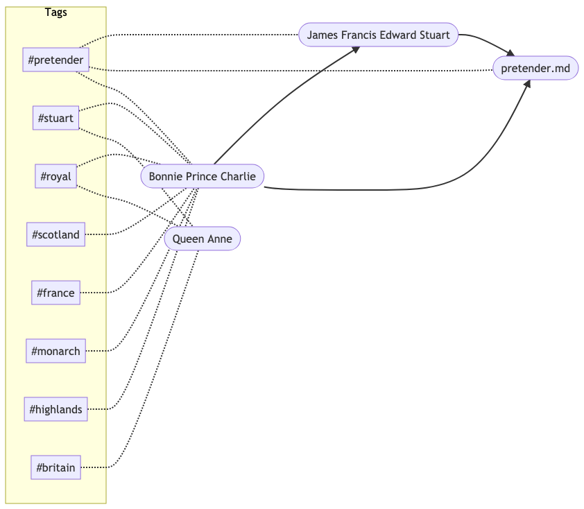

# search-notes

A search index and more for your markdown notes.

```sh
search-notes highlands              basic text search
search-notes name:wallace           search yaml frontmatter
search-notes "tag:royalty britain"  multiple terms
search-notes "brit*"                prefix search
search-notes "scatlond~1"           fuzzy search
search-notes "tags:stuart -france"  exclude terms
search-notes "tags:stuart +france"  boolean AND
search-notes "britain^2 france^1"   boost terms
```

```
% search-notes "scot* +tags:stuart" -d ./test/notes
Search took 0.017599736 seconds
┌─────────┬─────────────────────┬─────────┬────────────────────────────────────────────┐
│ (index) │        File         │  Score  │                    Hits                    │
├─────────┼─────────────────────┼─────────┼────────────────────────────────────────────┤
│    0    │ 'prince-charlie.md' │ '0.221' │ '"scotland" (body, tags), "stuart" (tags)' │
│    1    │   'queen-anne.md'   │ '0.189' │    '"scotland" (body), "stuart" (tags)'    │
└─────────┴─────────────────────┴─────────┴────────────────────────────────────────────┘
```

<!-- START doctoc generated TOC please keep comment here to allow auto update -->
<!-- DON'T EDIT THIS SECTION, INSTEAD RE-RUN doctoc TO UPDATE -->

- [search-notes](#search-notes)
  - [Install](#install)
  - [Features](#features)
    - [Metadata search](#metadata-search)
    - [Tag search](#tag-search)
    - [Link search](#link-search)
    - [Graphing Relations](#graphing-relations)
  - [CLI](#cli)
    - [Caching the search index](#caching-the-search-index)
      - [Without Cache](#without-cache)
      - [With Cache](#with-cache)
      - [Using the --write-cache (-w) flag](#using-the---write-cache--w-flag)
  - [TODO](#todo)
  - [License](#license)

<!-- END doctoc generated TOC please keep comment here to allow auto update -->

## Install

Zero-install: use npx to download and run

```
npx search-notes query
```

Global:

```
npm install -g local-notes
search-notes query
```

## Features

### Metadata search

Parses YML frontmatter into structured data you can query.

```md
---
title: Scottish History
year: 2020
---

# Scottish History

This is the body of the post.
You can query it using fuzzy search.
```

```
search-notes "title:scottish year:202* past~1"
```

### Tag search

```md
Hashtags are #indexed so you can #query them
```

```sh
search-notes tags:something
```

### Link search

Outgoing links are indexed, so you can look up "backlinks" (incoming links) by searching what links to a file. You can look up any link this way, not just local documents. E.g., you can find all documents that link to Wikipedia.

```md
# Find all documents that link to a page

search-notes -d test/notes "linksTo:SomePage"
```

```md
# See all links

search-notes -d test/notes "linksTo:\*"
```

### Graphing Relations

The `--graph` (`-g`) option produces a [Mermaid](https://github.com/mermaid-js/mermaid) diagram of the entity relationships in your files. Right now this is tags and links.

```
search-notes --graph
```



You can turn the chart into an image or PDF using Mermaid's CLI.

If you have `@mermaid-js/mermaid-cli` installed globally:

```
search-notes --graph > graph.mmd | mmdc -i graph.mmd -o graph.png
```

If you have `npx`:

```
search-notes --graph > graph.mmd | npx -p @mermaid-js/mermaid-cli mmdc -i graph.mmd -o graph.png
```



## CLI

```
search-notes --help
```

```text
search-notes [query]

Search for notes using structured data and full text index, with fuzzy matching.

Positionals:
  query  text to search for                                                                        [string] [default: ""]

Options:
  --directory, -d    directory to search in                                                        [string] [default: ""]
  --cache, -c        cached search index to use (ignored if file doesn't exist)         [string] [default: "search.json"]
  --write-cache, -w  create or update search index cache file                                  [boolean] [default: false]
  --explain          show relevance score and other details for results                         [boolean] [default: true]
  --version          Show version number                                                                        [boolean]
  --help             Show help                                                                                  [boolean]

Examples:
  search-notes highlands               basic text search
  search-notes name:wallace            search yaml frontmatter
  search-notes "tags:royalty britain"  multiple terms
  search-notes "brit*"                 prefix search
  search-notes "scatlond~1"            fuzzy search
  search-notes "scatlonz~2"            fuzzier search
  search-notes "tags:stuart -france"   negate term
  search-notes "tags:stuart +france"   boolean AND
  search-notes "britain^2 france^1"    boost term relevance
  search-notes "linksTo:filename"      incoming links
  search-notes --graph                 create node graph in mmd format
  search-notes -w                      re-index folder and save cache to disk
  search-notes -c index.json query     specify index cache file
```

### Caching the search index

Writing the search index to disk will significantly speed up subsequent queries.
The downside is you need to remember to update it when you files change.
In the future there might be a filesystem watch mode that can do this for you.

If you want to stop using the cache, just delete the file.

#### Without Cache

```
% search-notes "scot* tags:stuart" -d ./test/notes
Search took 0.018347418 seconds
┌─────────┬──────────────────────┬─────────┬────────────────────────────────────────────┐
│ (index) │         File         │  Score  │                    Hits                    │
├─────────┼──────────────────────┼─────────┼────────────────────────────────────────────┤
│    0    │ 'william-wallace.md' │ '1.181' │            '"scottish" (body)'             │
│    1    │ 'prince-charlie.md'  │ '0.221' │ '"scotland" (body, tags), "stuart" (tags)' │
│    2    │   'queen-anne.md'    │ '0.189' │    '"scotland" (body), "stuart" (tags)'    │
└─────────┴──────────────────────┴─────────┴────────────────────────────────────────────┘
```

#### With Cache

```
% search-notes "scot* tags:stuart" -d ./test/notes
Search took 0.001248612 seconds
┌─────────┬──────────────────────┬─────────┬────────────────────────────────────────────┐
│ (index) │         File         │  Score  │                    Hits                    │
├─────────┼──────────────────────┼─────────┼────────────────────────────────────────────┤
│    0    │ 'william-wallace.md' │ '1.181' │            '"scottish" (body)'             │
│    1    │ 'prince-charlie.md'  │ '0.221' │ '"scotland" (body, tags), "stuart" (tags)' │
│    2    │   'queen-anne.md'    │ '0.189' │    '"scotland" (body), "stuart" (tags)'    │
└─────────┴──────────────────────┴─────────┴────────────────────────────────────────────┘
```

#### Using the --write-cache (-w) flag

You can invoke `search-notes -w` with no search option to index the folder and write the index to disk.

```
% search-notes -d ./test/notes -w
Updated index file in 0.02012653 seconds
Search took 0.021347405 seconds
┌─────────┬──────────────────────┬─────────┬──────┐
│ (index) │         File         │  Score  │ Hits │
├─────────┼──────────────────────┼─────────┼──────┤
│    0    │ 'prince-charlie.md'  │ '0.000' │  ''  │
│    1    │   'queen-anne.md'    │ '0.000' │  ''  │
│    2    │ 'william-wallace.md' │ '0.000' │  ''  │
└─────────┴──────────────────────┴─────────┴──────┘
```

## TODO

- [x] index/reindex command
- [x] search command
- [x] index links between notes (`"linksTo:somewhere.md linkedFrom:elsewhere.md"`)
- [x] backlink visualizer (node graph)
  - [x] static output
  - [x] use mermaid-cli
  - [ ] web page output
  - [ ] filter-then-display
- [ ] index nested folders
- [ ] add package version to the cache file to verify compatibility
- [ ] more sensible search defaults (see elasticlunr)
- [ ] more output formatting options
  - [ ] add json output mode
  - [ ] print snippet of file around hits (like `grep -n`)
- [ ] add more remarkable plugins out of the box (LaTeX formula rendering, etc)
- [ ] extract core modules from CLI, to enable re-use
- [ ] extract filesystem metadata and index that
- [ ] use filesystem modification times to suggest rebuilding cache file
- [ ] background process for watching file changes and reindexing
- [ ] server for viewing & browsing rendered notes, with search embed
- [ ] incremental index update (not supported by lunr)
- [ ] command to set up git to treat index file as binary (see .gitattributes)
- [ ] webcomponent for embedding search in markdown
- [ ] add .searchignore file
- [ ] numeric data types for metadata ("rating > 4") _hard_
- [ ] package as a binary instead of nodejs library
  - [ ] electron app that acts as a container for background processes and wraps CLI
- [ ] consider re-licensing as something other than basic MIT
- [ ] some sort of handling for daily notes/bullet journaling

## License

[MIT](./LICENSE)
